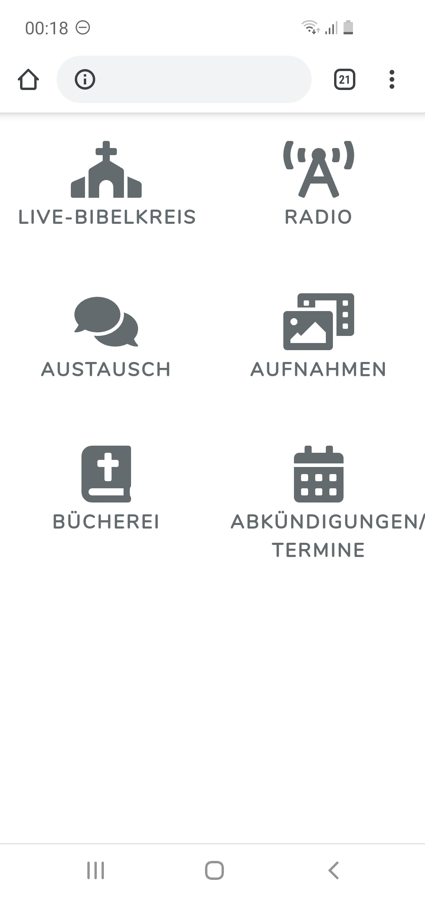
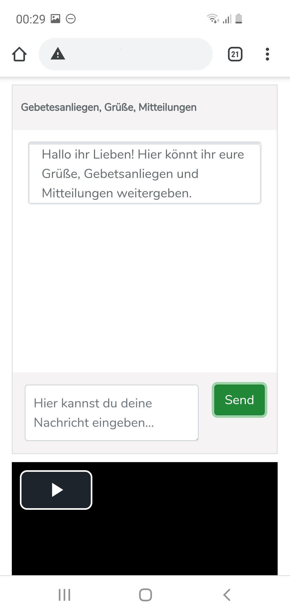
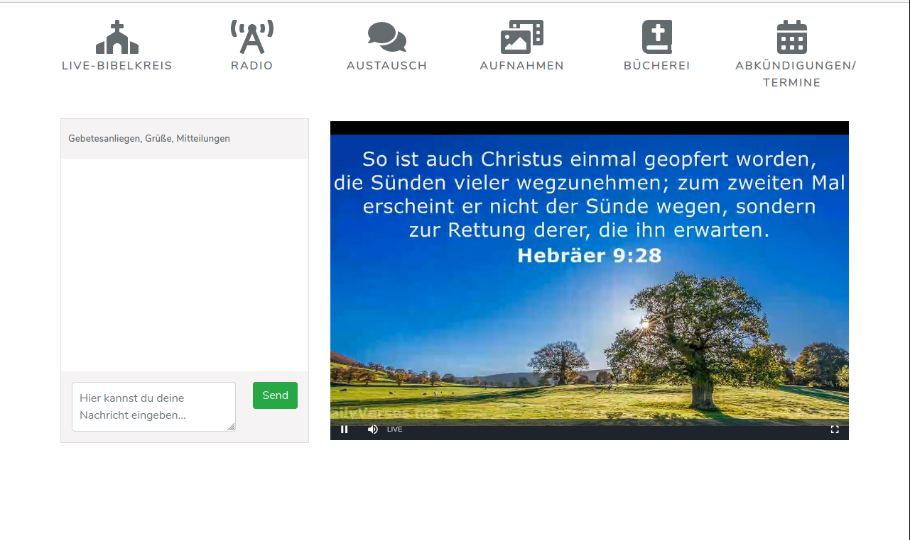
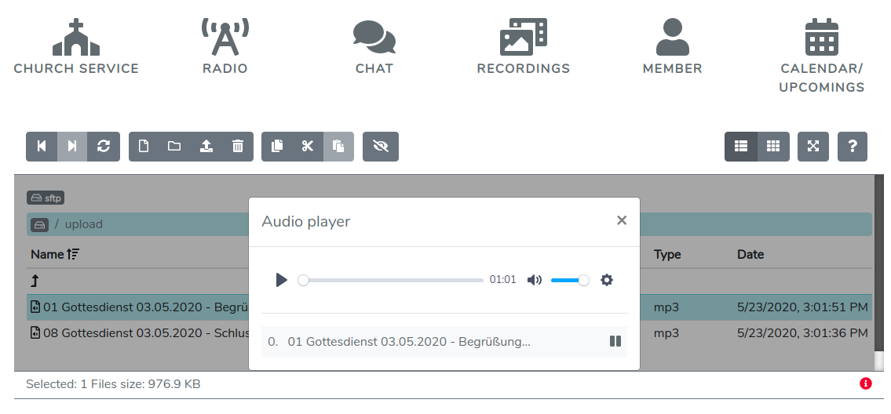

 TODO logo idea: ice-brick texture 
 

&nbsp; &nbsp; &nbsp; &nbsp; &nbsp; &nbsp;    

   

## About Chabaa

Chabaa (acr. for: chabaa aids bible accorded assemblies, כבא in hebrew means to retreat or harden).
 It is an app supporting churches to use digital capabilities for their gatherings and cooperations and is a response
 to corona-enforced shutdowns of german churches.
 It comprises 

- streaming church services through common desktop and mobile web-browsers using hls (latency 15s) and 
   rtmp (flashvideo, with latency of 2s, but which has fewer browser compatibility).
- audio streaming church services 
- Chat area next to the streaming frames
- file manager for up- and download of church service recordings and for in-browser playing of its contents
- authentication of church members, administrators and guests
- [Upcoming] Chat-App with User Management and user status management for encouraging communication between church members  
- [Upcoming] Management of "calendar" and "About"-contents of the app 

## Learning Chabaa
A pictured documentation is planned for navigating you through all of chabaa's features 

## Contributing

Thank you for considering contribution to the chabaa online church app!   
In brief chabaa integrates a couple of free tools to make an app to aid churches
in their digital struggle after corona lockdowns. For an overview of reused modules take a look
at the docker-compose.yml.

## Security Vulnerabilities

If you discover a security vulnerability within chabaa, please send a notification via my github account.

## License

The Chabaa online church app is open-sourced software licensed under the [GPL license](https://opensource.org/licenses/GPL-3.0).

# Installation

### Before you start
chabaa occupies the ports 80 (webserver. E.g apache), 8000 (video-streaming), 8008 (webradio), 6001 (websocket) 
by default. 
Stop any other applications running on these ports or configure chabaa for using other ports inside chabaas .env file.
On common vanilla linux application, you'll probably just want to stop apache: sudo service apache2 stop. 

## STEP 1: prerequisite: install and activate docker, install docker-compose, nodejs, npm and git 
    sudo apt-get install docker-compose docker.io npm nodejs git
    sudo adduser `whoami` docker
    sudo systemctl enable docker
    sudo service docker restart

## STEP 2: install chabaa and its dependencies. In your installation directory do:
    git clone https://github.com/dioniswe/chabaa.git chabaa
    cd chabaa
    composer install
    npm install
    npm run dev

### STEP 3 configure your chabaa application.
 
Modify .env: set values for

    ICECAST_SOURCE_PASSWORD to authenticate audio streaming sources
    ICECAST_MOUNT_NAME for the audio streaming url path

    CHABAA_ADMIN_USER for generating the chabaa admin user (responsible for app contents of startpage and recordings)
    CHABAA_ADMIN_PASSWORD  for setting the chabaa admin password

    CHABAA_CONGREGATION_USER for generating the chabaa congregation user (the website user)
    CHABAA_CONGREGATION_PASSWORD for setting the chabaa congregation password
    
### STEP 4 Bring up the containers finally

    docker-compose up -d

## STEP 5 after building, initialize your laravel application
    docker-compose run chabaa php artisan key:generate
    docker-compose run chabaa php artisan migrate

## Step 6 (optional) install google fonts locally
    mkdir  public/vendor/fonts
    npm install -g google-font-installer
    gfi download Nunito -d public/vendor/fonts

If you want to contribute in development in Step 4 do
    
    export USER_ID=$(id -u ${USER});  export GROUP_ID=$(id -g ${USER});  docker-compose up -d

This will make your docker container's users to have the same user id as you have, preventing trouble on shared folders.  

# Usage

Stream to your 'Radio'-Section using any icecast2 compatible client (i.e Butt). In butt settings fill in your server's domain,
your configured port (default port: 8008) and your configured source authentication key

Stream to your 'Church-Service'-Section using any rtmp-compatible client (i.e OBS). In obs settings fill in your server's domain, 
your configured port (default port: 8000) and your configured streaming key (default key: stream_name)

Chatting works straight

For the recordings management an admin user has been created on laravel initialization who is privileged to upload files.
The congregation user is privileged to download and play files.

  

